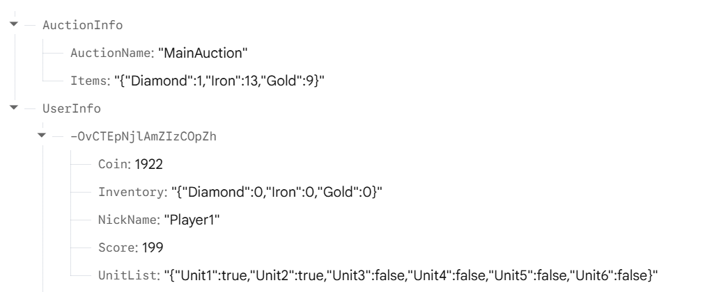

# Firebase + Unity 기능

### 구현한 기능 목록

1. UserData
    
    사용자 데이터 객체
    
    데이터:
    UserKey - 유저 고유키(Firebase 자체 생성)
    NickName - 유저 닉네임
    Coin - 코인 개수
    Score - 최고 점수
    Inventory - 보유 아이템 딕셔너리<아이템 이름, 개수>
    UnitList - 보유 유닛 딕셔너리<유닛 이름, 보유 여부>
    
2. UserRegister
    
    사용자 회원 가입 기능
    
    Firebase database
    중복 닉네임 체크 후, UserData생성 후, 저장 처리
    
3. UserLogin
    
    사용자 로그인 가입 기능
    
    Firebase database
    존재하는 닉네임인지 체크 후, 해당 닉네임을 클라이언트의 userKey로 저장
    
4. ShopManager
    
    상점에서 플레이어 아이템 구매 기능
    
    Firebase database
    코인이 충분한지 체크 후, Coin, Inventory 데이터 저장
    
5. InventoryManager
    
    인벤토리에 아이템을 사용 기능
    
    Firebase database
    인벤토리내, 아이템 개수 충분한지 체크 후,  Inventory 데이터 저장
    
6. UnitManager
    
    유닛 상점에서 유닛 구매 기능
    
    Firebase database
    이미 소유하고 있는 유닛이 아니고 코인이 충분할 경우, Inventory, Coin 데이터 저장
    
7. RewardManager
    
    점수(보상) 획득 기능
    
    Firebase database
    최고 점수 달성 시, 기존 점수를 덮어씌워서 Score 데이터 저장
    
8. AuctionManager
    
    경매장 물품 등록, 구매 기능
    
    Firebase database
    1.  AuctionInfo가 없을 경우, AuctionInfo 생성
    2. 경매장 물품 등록 :
        유저 물품 개수 충분 체크 후, 경매장(Items), 유저(Inventory, Coin) 데이터 저장
    3. 경매장 물품 구매 :
        경매장 물품 개수 충분 + 유저 코인 충분 체크 후, 경매장(Items), 유저(Inventory, Coin) 데이터 저장
    
9. AucitonData
    
    경매장 데이터 객체 
    
    데이터 : 
    AuctionName - 경매장 이름
    Items - 경매 물품 딕셔너리<물품명, 개수>
    

### 내가 만든 아이템 3종

1. Diamond - 다이아몬드
2. Gold - 금
3. Iron - 철

### 각 아이템 가격표

1. Diamond - 200
2. Gold - 150
3. Iron - 50

### Firebase 데이터 구조 설명



- AutionInfo : 경매장 정보 (현재 경매장 1개만 사용)
    - AuctionName : 경매장 이름
    - Items : 경매 물품<키-물품 이름 : 값-개수>
- UserInfo : 유저 정보 Root 노드
    - 유저 고유 키 : 각 유저가 가지는 고유 값
        - Coin : 코인 개수
        - Inventory : 보유 아이템 딕셔너리<키-아이템명, 값-개수(int)>
        - NickName : 유저 닉네임
        - Score : 최고 점수
        - UnitList : 보유 유닛 딕셔너리<키-유닛명, 값-보유 여부(bool)>

### `PlayerPrefs`에 저장한 값 설명

1. UserKey : 유저 고유 키(string) - 회원가입, 로그인 성공후, 저장
2. UserNickName : 유저 닉네임(string) - 회원가입, 로그인 성공후, 저장

### `Inventory` JSON 처리 방식 설명

InventoryManager에서 아이템 사용 후, firebase database Inventory 데이터 변경

Firebase database에 Inventory 데이터 저장

```csharp
string inventoryJson = JsonConvert.SerializeObject(inventory);
reference.Child("UserInfo").Child(userKey).Child("Inventory")
.SetValueAsync(inventoryJson).ContinueWith(task =>{ //중략...});
```

<aside>
💡

설명

1. `string inventoryJson = JsonConvert.SerializeObject(inventory);`
Dictionary<string, int>타입인 inventory를 firebase database 올리기 전에 Json으로 직렬화 변환 처리
2. `reference.Child("UserInfo").Child(userKey).Child("Inventory").SetValueAsync(inventoryJson)`
RootReference에서 하위노드인 UserInfo, userKey,inventory로 점점 내려가서 가장 마지막 노드인 Inventory에서 SetValueAsync(inventoryJson)식으로 인벤토리 데이터 저장
</aside>

Firebase database에 Inventory 데이터 로드

```csharp
reference.Child("UserInfo").Child(userKey).Child("Inventory")
.GetValueAsync().ContinueWith(task => 
{
    DataSnapshot snapshot = task.Result;
    string json = snapshot.Value.ToString();
    inventory = JsonConvert.DeserializeObject<Dictionary<string, int>>(json);
}):
```

<aside>
💡

설명

1. `reference.Child("UserInfo").Child(userKey).Child("Inventory")`
RootReference에서 하위노드로 내려와 Inventory까지 접근
2. `.GetValueAsync().ContinueWith(task => {})`
GetValueAsync()를 통해서 값을 받아오는데 해당 값은 task를 통해서 받음.
3. `DataSnapshot snapshot = task.Result;
 string json = snapshot.Value.ToString();
 inventory = JsonConvert.DeserializeObject<Dictionary<string, int>>(json);`
task.Result.Value.ToString()으로 inventory Json을 받고 다시 역직렬화 함수를 통해서 Dictionary로 반환.
</aside>

### 실행 중 발생한 문제와 해결 방법

- 소스 코드
    
    ```csharp
    [System.Serializable]
    public class AuctionData
    {
        string AuctionName;
        string Items;
    
        public AuctionData(string auctionName)
        {
            Dictionary<string, int> items = new Dictionary<string, int>();
            items["Diamond"] = 0;   //다이아몬드 - Diamond
            items["Iron"] = 0;     //철 - Iron
            items["Gold"] = 0;   //금 - Gold
    
            AuctionName = auctionName;
            Items = JsonConvert.SerializeObject(items);
        }
    }
    
    !!AuctionManager.cs의 CreateAuction함수만 참조 확인!!
    
    //Firebase 경매장 데이터 생성
    void CreateAuction()
    {
        DatabaseReference auctionRef = reference.Child("AuctionInfo").Push();
        auctionKey = auctionRef.Key;
    
        AuctionData auctionData = new AuctionData(auctionName);
        string json = JsonUtility.ToJson(auctionData);
    
        auctionRef.SetRawJsonValueAsync(json).ContinueWith(task =>
        {
            if (task.IsFaulted)
            {
                dispatcher.Enqueue(() =>
                {
                    UpdateMessageText("경매장 데이터 생성 실패");
                });
                return;
            }
    
            dispatcher.Enqueue(() =>
            {
                PlayerPrefs.SetString("AuctionName", auctionName);
                PlayerPrefs.SetString("AuctionKey", auctionKey);
                PlayerPrefs.Save();
    
                UpdateMessageText("경매장 데이터 생성 성공");
            });
            LoadAuctionItemData();
        });
    }
    ```
    

<aside>
💡

설명

AuctionManager에서 CreateAuction()으로 firebase database에 AuctionInfo를 루트로 하는 AcutionData를 만든는 기능

*문제점* : CreateAuction()는 실행이 되지만 firebase database에 데이터가 만들어지 않는 상황

*원인 분석*: 
AuctionData에 필드인 AuctionName, Items 값이 public이 아닌 private으로 되어 있었음.

`auctionRef.SetRawJsonValueAsync(json)`은 [**Firebase Realtime Database**](https://firebase.google.com/docs/database/unity/save-data?hl=ko)에서 지정한 경로의 데이터를 원시 JSON 문자열로 덮어쓰거나 생성할 때 사용하는 비동기 메서드임. 그래서 C# 객체인 `AuctionData`를 직접 저장하는 대신, `JsonUtility.ToJson()` 등으로 미리 변환한 JSON 문자열로 변환시켜서 매개변수로 넘겨줘야됨.

이때, `JsonUtility.ToJson()`는 C# Class의 public인 field를 JSON 문자열로 변환시켜주는데
AuctionData의 모든 field를 private로 선언해서 안됨.

</aside>